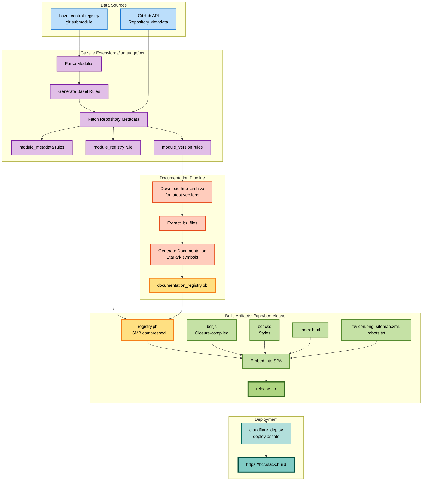

# bcr-frontend

This repository provides a web UI and API for the [Bazel Central Registry](https://github.com/bazelbuild/bazel-central-registry).

- A git submodule is located at `data/bazel-central-registry`.
- A custom gazelle extension `//language/bcr` walks the module tree under `data/bazel-central-registry/modules`, creating a set of build rules that represent the state of the registry.  The various modules and module versions are linked into a top-level `module_registry rule //data/bazel-central-registry/modules:modules`.  A makefile target `make bcr` can be run locally that checks out the most recent version of the submodule and runs the gazelle extension.
  - NOTE: `GITHUB_TOKEN` is required for fetching repository metadata during a
    gazelle run.
- A protobuf representation of the state of the BCR is constructed by `bazel build //data/bazel-central-registry/modules:modules`.  This includes downloading source repository archives for latest versions (that include starlark files) and extracting stardoc for them, outputting the file `bazel-bin/data/bazel-central-registry/modules/registry.pb`.
- `bazel run //app/bcr:release` builds the frontend single-page-application UI
  and embed the registry proto data in it, and starts a webserver for local development.
- `bazel //app/api` builds a rust->wasm app that runs as a cloudflare worker to service API requests.  The UI does not currently depend on the API; the primary purpose is to support shields.io-like badges (example: ).  The API also serves fragments of the `Registry` protobuf data.
- `bazel run //app/bcr:deploy` builds the UI and API and deploys it to cloudflare.

CI works as follows:

- [ ] When new commits land in `github.com/bazelbuild/bazel-central-registry`, a
  repository dispatch triggers the `update-bcr-submodule` job, which creates a
  new PR that updates the submodule commit and labels the PR with
  `bcr-auto-update`.
- [x] A cron job (triggers every 30m) also calls `update-bcr-submodule`.  This
  will be disabled once repository dispatch is setup.
- [x] The `deploy-and-merge-bcr-pr` runs gazelle on the submodule, builds and deploys an updated version to cloudflare.  A successful PR of this type is auto-merged.

## Build Pipeline

## Maintenance and Support

This repo is funded by contributions to our
[OpenCollective](https://opencollective.com/bazel-rules-authors-sig/projects/bazel-central-registry).
Maintenance is performed on a best-effort basis by volunteers in the Bazel
community.

## Contributing

We are happy about any contributions!

To get started you can take a look at our [Github
issues](https://github.com/bazel-contrib/bcr-frontend/issues).

Unless you explicitly state otherwise, any contribution intentionally submitted
for inclusion in the work by you, as defined in the Apache-2.0 license, shall be
licensed as below, without any additional terms or conditions.
